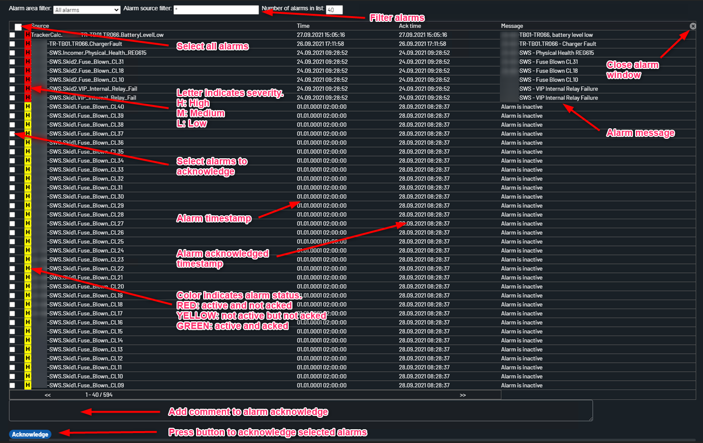

# Alarm List

The alarmlist shows current alarm state for alarms on plant.

Alarm area filter: where we can select alarm area that is Plant alarms and communication alarms. 

Alarm source filter: where we can select the module and individual alarms can show.

Nuumbers of alarms in list where can put the number is alarms show in a list.

The leter that is on left side which is H, M and L which indicate severity of High, Medium and Low respectively.

The color Indicate alarm status that is Red: Active and not acknowledge. Yellow: not active and not not acknowledge. Green: active and acknowledge

There is time alarms time stamp

Ther is acknowledge time 

The message column show the alarms messages.

On the below of the page there is acknowledge box for acknowledge the alarms by selecting on the left button.

Example below with explanations.

