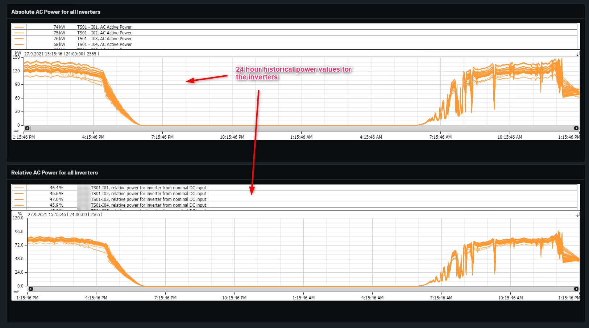

# Inverter Power Overview

Shows power for all inverters. Charts split into equal nominal power.

On the Absolute AC Power for all inverters shows active power for all individual inverters for the timestamp of 24 hours which will help for better graphical analysis.

On the Recative AC Power for all inverters shows Relative power for all individual inverters for the timestamp of 24 hours which will help for better graphical analysis.

Example below with explanations.

