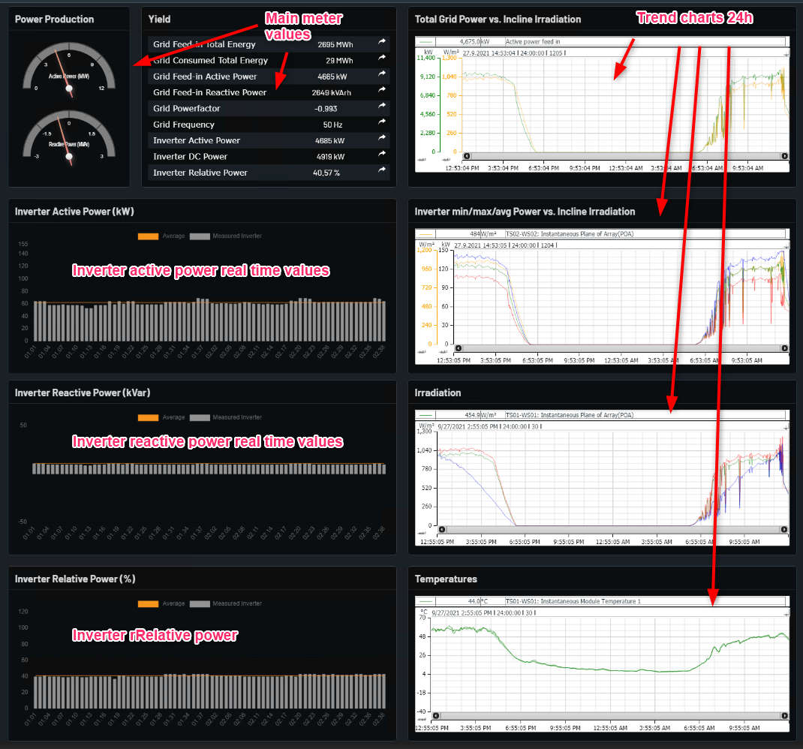

# Overall Production Overview

Shows production data for plant.

In overallproductionioverview page shows total Production of plant

In power production box on the left side shows the graphical representaion in speedometer of Active and Recative Power of plant.

In Yield Table show the main meter values that is exported and imported energy, Active and Recative power, Powerfactor and frequency.
In Yield table there is an arrow symbol by clicking it can show the graphical representaion of values respectively.

In Inverter Active, Recative and Relative Power Bar graph show the real time values in Bar-Graph with an average value line for better analysis which inverter working most efficient and which are below.

On the right side of page there is number of different trends with 24 hours timestamp for overall production overview.

Example from Norway Oslo below with explanations.

