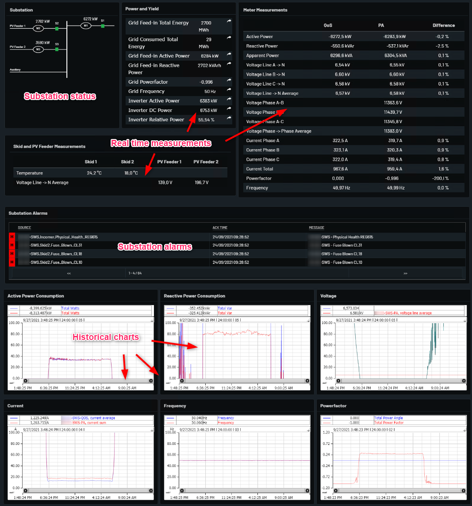

# Substation

Shows the substation metering and status values.

In Power and Yield Table there is Total plant value that shows the whole plant "Energy", "Power", "Power Factor","frequency" and "DC Power". In Power and Yield table there is an arrow symbol by clicking it can show the graphical representaion of values.

Meter Measurements Table contain the real time data of Plant Meter with difference of Meter.

Substation Alarm table have acive Alarm of plant substation with containing column of ack-time and message.

Substation page have Historical chart or trends of better graphical representaion of substation plant for visualization and analysis. 

Example from Norway Oslo below with explanations.

