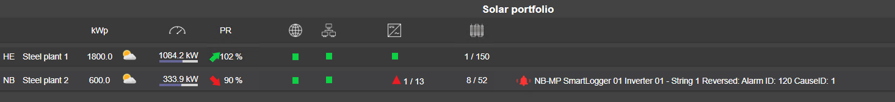

# Portfolio Overview

The portfolio overview screen shows main status data for each plant:

* Area code
* Site name
* DC Nom. power
* Current weather forecast
* Total current inverter active power
* PR performance: green arrow when PR is above budget, red arrow when PR is less than budget - 5%, else no arrow is shown.
* PR: Shows current PR.
* Edgebox communication: Shows the communication status from the central server to the plant.
* Plant equipment communication: communication status for all equipment for site. Shows red if less than 5% of the plant equipment has communication loss.
* Inv: inverter status, green if all OK, yellow if more than 1 in failure, red if more than 2 in failure.
* String: Number of strings that are under performing.
* Alarm: Last active high severity alarm not acknowledged.

