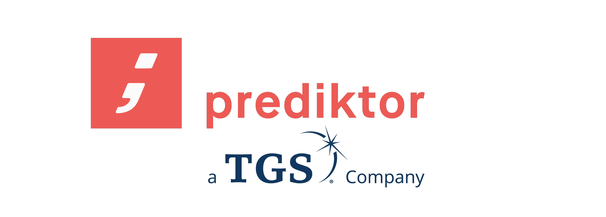

# Help Start Up

This is an online help system for the PowerView control, monitoring and reporting system for the PV plants, developed by Prediktor AS.

It is a combined help for the local plant version of the systems as well as the central control room and enterprise reporting solution. It contains general help topics for general concepts of the system ,but also specific help for each plant and the screens and data contained in each plant solution.

The plant portal help system will not contain the specific help topics for other plant solutions.

Select items from the table of contents menu to the left, or search for help topics in the built-in search system.

Help desk at Prediktor is available. If your issue is urgent and you have a Service Level Agreement (SLA), please make sure that you call us at the number you have been given and/or send us an email at support@prediktor.com. 

