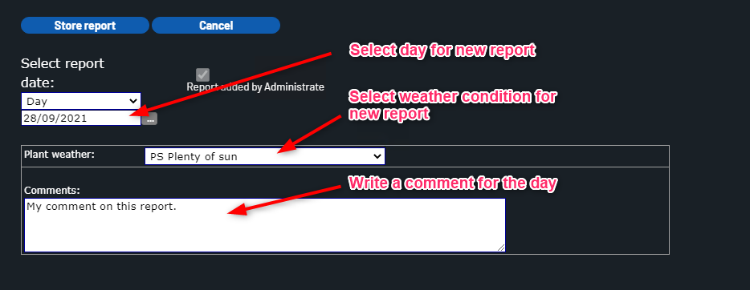

# Daily Plant Report

The daily reports are used to add textual comment and weather status for each day.

New report is created for each day.

Comment and weather data are presented in daily KPI report in central portal.

