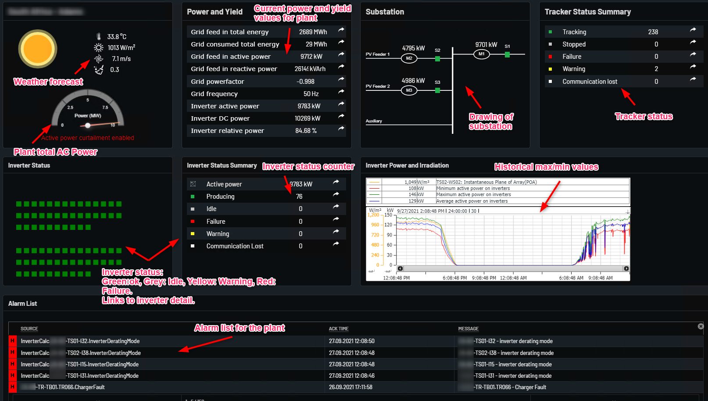

# Plant Overview

Plant overview page shows main data for whole plant.

In Power and Yield Table there is Total plant value that shows the whole plant "Energy", "Power", "Power Factor","frequency" and "DC Power".
In Power and Yield table there is an arrow symbol by clicking it can show the graphical representaion of values.

In Substaion Box its showing the Substation MV breaker status and Power in Line.

In Tracker Status Summary box it shows the plant total number of trackers function, stopped, failur, warning, and commuication lost.
In Tracker status Summaery Box ther is an arrow symbol by clicking it can show the graphical representation of values.

In Inverter Status Box it shows the inverter working status that is green means ok, grey means idle, yellow means warning, red means failure.
By clicking on box status open the inverter detail page of the one which you slect.

In Inverter Status Summary Box its shows the counter of how many are ok, idle, warning, an in failure. By clicking on the arrow its show the data in graph from database.

In the below of the page there is Alarm List which shows all the alarms of the plant 

Clicking on inverters statuses open inverter detail page.

Example with explanations below:

