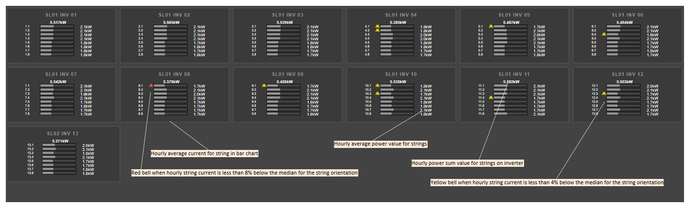
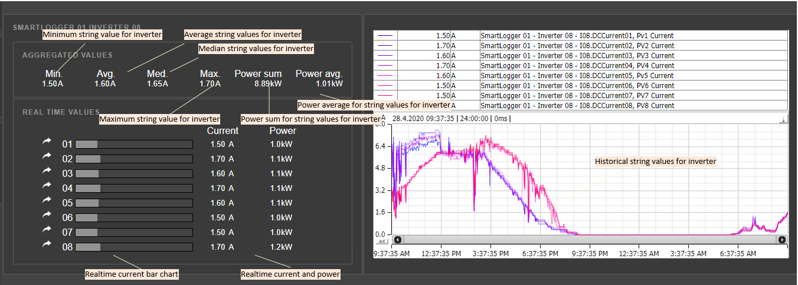

# PView - String Monitor Overview

Shows string monitor data for plant.

Clicking on one of the bars open details for the strings on a specific inverter.

Example below with explanations. The alarm calculation is based on string orientation (east/west/other).

Details screen:

