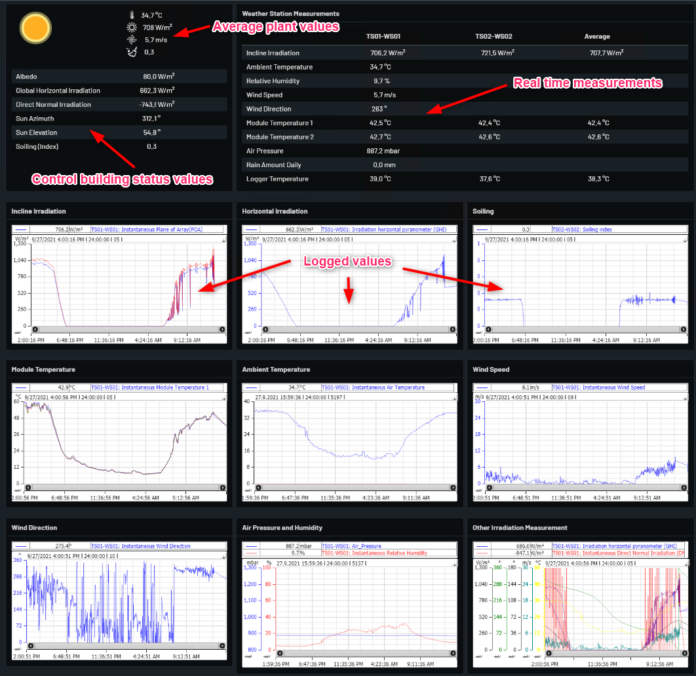

# Weather Data

Shows the weather data for plant.

Weather station Measurements table contains the data of weather module that are available in plant.

Weather station Measurements table include incline irradiation, ambient temp, Windspeed and other data that are available on module.

Weather station Measurements table contains average data between all the module that are available.

Weather data page have Historical chart or trends of better graphical representaion of weather module data for visualization and analysis.

Example from Norway Oslo below with explanations.

