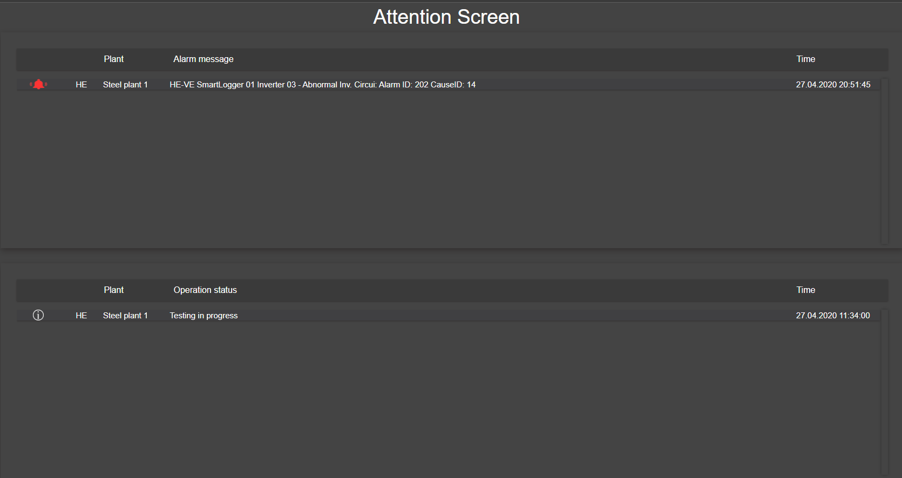

# Attention Screen

The attention screen shows main alarms and comments for each plant.

Alarms and comments activated/updated the last hour are colored with a red color.

__Alarm__

* Area code
* Site name
* Alarm: Last active high severity alarm not acknowledged.

__Comments__

* Area code
* Site code
* Comment: Last plant comment

