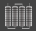

# CMC Regional Overviews

These screens shows data for one region. Clicking on one plant, zooms into that plant.

Following information elements:

* Header:
    * Current production for region
    * Name of region
    * Total energy production for region
* Info per plant
    * Power gauge area: shows real time values for power, voltage and current
    * Weather info area: real time values for weather on plant. Weather symbol from Yr.
    * Communication links: click on e.g. email symbold to open email for plant contact person
    * Charts:
        * Inverter: incline irradiation per stations vs. inverter power in a radar charts
        * Power difference: percentage difference from average for all inverters.
        * Production: power vs. irradiance
    * Status area:
        * Shows main status for plant
            * Green: number of OK
            * Yellow: number of warning
            * Red: number of alarm/error
            * Grey: number of not connected
        * Clicking on status opens Plant Overview page
        *  Inverter status. Clicking on symbol opens inverter details page.       
        *  Tracker status. Clicking on symbol opens tracker overview page.                      
        *  Grid conenction point status. Clicking on symbol opens grid transfoermer switch overview.
        *  String monitoring status. Clicking on symbol opens string monitoring overview page.         
        *  Communication status with plant
    * Status tower: Shows summarized status for inverters, trackers and grid
    * PPC setpoints: shows main PPC setpoint values and status
    * Inverter grid: Shows status for all inverters. Clicking on inverter opens inverter details page.
    * Alarm list shows active alarms that have not been acknowledged.
