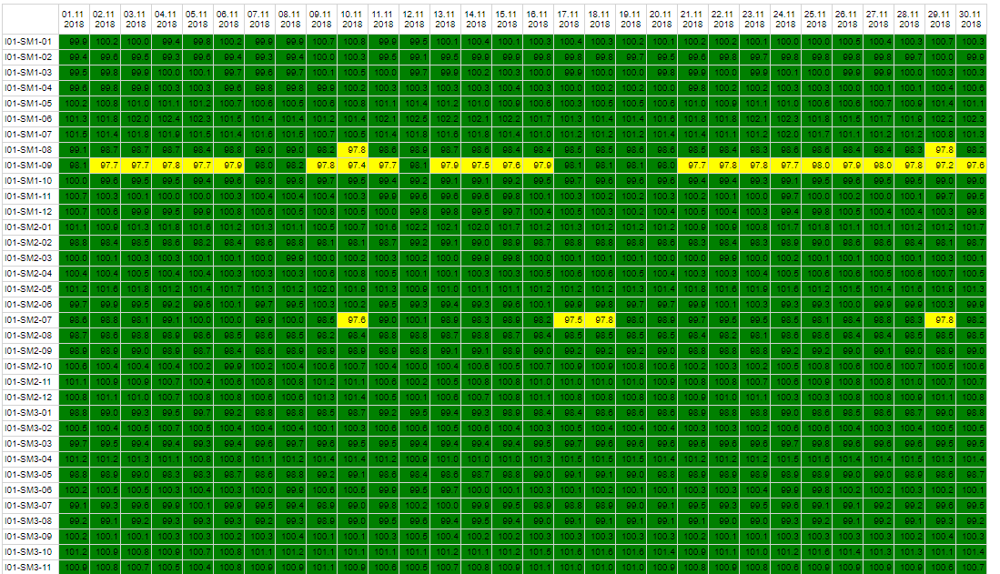

# String Monitor Report Interval

Report showing string monitor performance per string channel and day.

Not for all plants, requires setup of strings in grid.

Input parameters are:

* Start and End period: used if not period is used. Un-check both boxes before use.
* Period type and period: select report period if not start and end time is used
* Continent: filter continent
* Country: filter country
* Facility: select plant    
* Name filter: String channel filter
* Warning level 1,2 and 3

Following data is shown:
   
* Table per interval and string channel.
    * Relative energy values
    * Color coding

