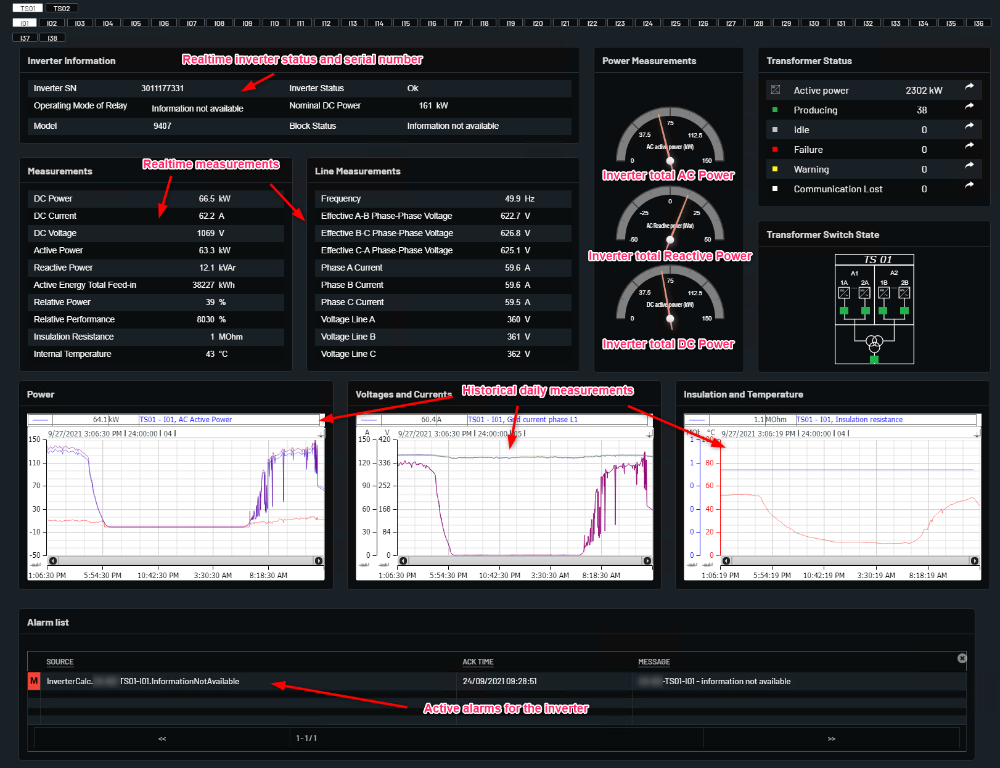

# PView - Inverter Details

Shows detailed data for inverters. Different setup for the different suppliers.

On the inverer Detail page, on the top of the page there is navigation box where can select each indivitual Transformer and inverter to navigate.

On the Invereter Information box there are are information for each individual transformer data and inverter data that is serial number, Inverter Status, Model, and operation mode.

In Measurements table there is individual inverter value that shows the Inverter "Energy", "Power", "Power Factor","frequency" and "DC Power".

In line Measurements table shows individual inverterdetails of line to line current and voltage and phase to phase voltage and current.

In power Measurements there is graphical representaion of AC Power, Recative power, DC power in speedometer.

In Transformer Status table it shows the plant total number of Inverter function, stopped, failur, warning, and commuication lost. In Transformer status table there is an arrow symbol by clicking it can show the graphical representation of values.

In Power, Volatge and Current, Insulation of Temperature shows the historical graph for analyis.

On the below page there is alrm list which show individual active alarm on the inverter.

Example from Huawei string inverter below with explanations.

