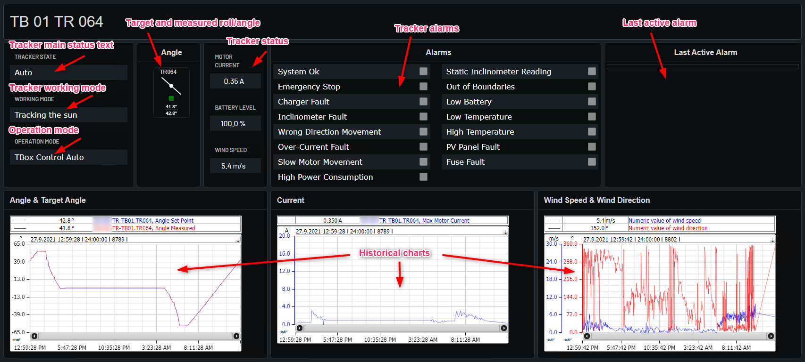

# Tracker Data

Shows tracker data for plant if available. Different setup for the different tracker types.

Normally 2 or 3 levels:

* Overview plants
* Overview station (not on all)
* Tracker details

Example from Norway Oslo below with explanations. SHowing soltec trackers.

Level 1, station:

 

Level 2, tracker:

