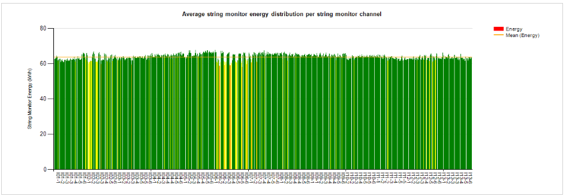

# String Monitor Report

Report showing string monitor performance per string channel.

Not for all plants, requires setup of strings in grid.

Input parameters are:

* Start and End period: used if not period is used. Un-check both boxes before use.
* Period type and period: select report period if not start and end time is used
* Continent: filter continent
* Country: filter country
* Facility: select plant    
* Name filter: String channel filter
* Warning level 1,2 and 3

Following data is shown:
   
* Table with summary data
* Chart with average string energy per channel with average and color coding
* Chart with average string energy per combiner box with average and color coding
* Chart with average string energy per inverter with average and color coding
* Tables showing string monitor data
    * Power and energy values
    * Energy relative to group energy (%)
    * Number of continous days below warning 3 level
    * Number of continous days below warning 2 level
    * Number of continous days below warning 1 level
* Heat map showing strings in map with color coding

