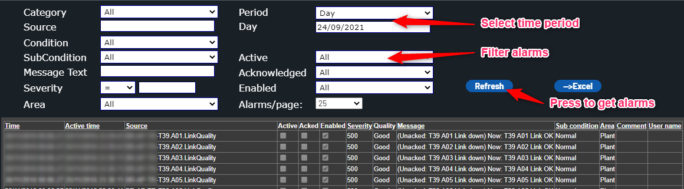

# Historical Alarm Report

The historical alarm report reports logged alarms stored in the ACT plant database.

The report contains a filter area, to filter the result. By pressing the "Refresh" button, the report table is generated.

The following filters are available:

* Category: filter on alarm category (most alarms discrete)
* Source: filter the alarm source. Use % as wildcard, e.f. %NO-OS-TS%
* Condition: filter on alarm condition
* SubCondition: filter on alarm sub-condition, e.g. active or inactive
* Severity: filter on severity.
* Area: filter on alarm area. Standard is plant and communication.
* Period: time period for report
* Active: select active/inactive filter
* Acknowledge: select acknowlege/not acknowledge filter
* Enabled: select enabled/not enabled filter

Result table can be sorted pressing header text on each column. Table contains following columns:

* Time: Time of last state change
* Active time: time when alarm got active
* Source: source tag of alarm
* Active: if alarm state is active
* Acked: if alarm is acknowledged
* Enabled: if alarm is enabled
* Severity: severity number of alarm from 1-1000
* Quality: data quality of alarm tag
* Message: alarm message
* Sub condition: alarm sub condition
* Area: alarm area
* Comment: acknowledge comment
* User name: user acknowledging alarm

The number of alarms set in "Alarms/page" (default 25) are shown on a page at a time. Use the paging links in the bottom of the table to change page.

Data can be exported to Excel pressing the "--> Excel" button. Only data shown on the page is exported. Increase "Alarms/page" and press refresh to get more alarms in the Excel file. Save or open the file.

 