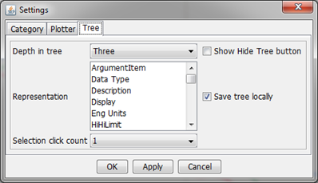
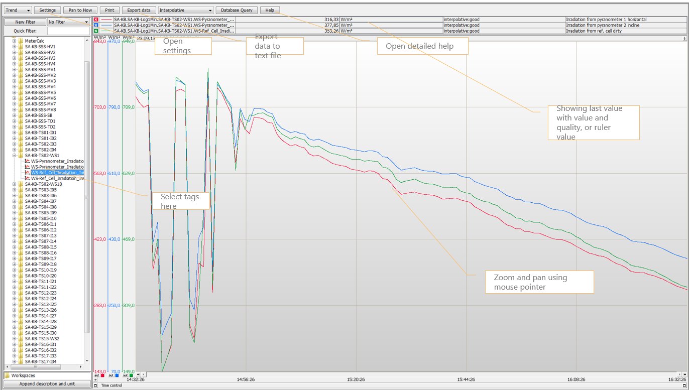

# APIS Process Explorer

APIS Process Explorer shows graphical trends from the APIS Historian database. Java must be installed on computer to open application.

Data is per default presented as a time chart. Data can be exported to csv file and imported into e.g. Excel.

The application is opened from the portal menu for each plant, and common for all plants under Enterprise menu.

In Google chrome, warnings pop up in lower left corner. Please press "Keep" and "download" to open the application. An how to guide for installing an AdoptOpenJDK version of Java which can be used to run PE is described here.

Tags are selected in the tag browser tree to the left. Press the database icon to open the tree. This might take some time. To improve the speed, select settings menu from the top and the following main settings:

Depth in tree: three
Save tree locally: checked

 Example below.

User can store workspaces. After selecting tags and time parameters, right click workspaces and give workspace a name. After saved, it can be opened again with the same tags. User can store workspaces common for all or just for own use (personal workspaces).

For more help on this application, press the "Help" button in the page after opened the application.
