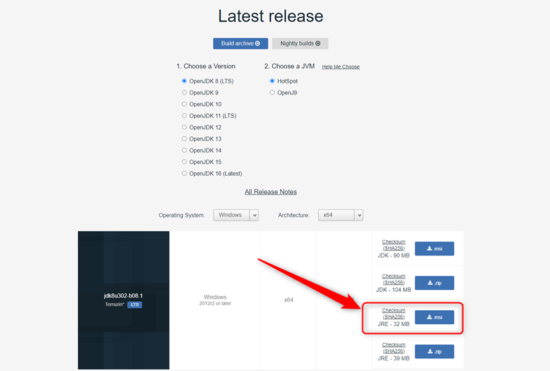
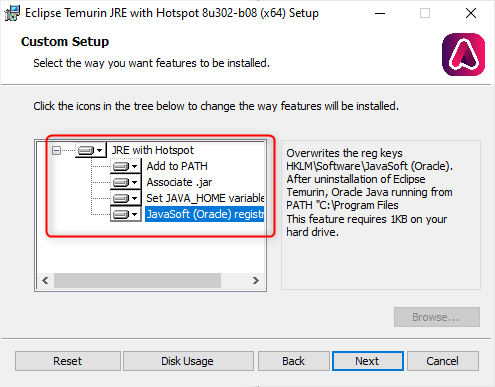
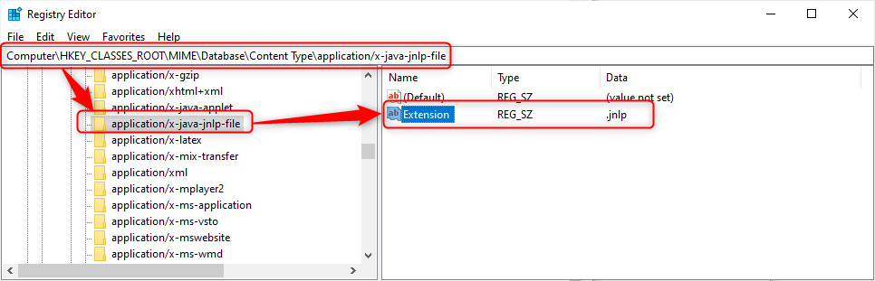
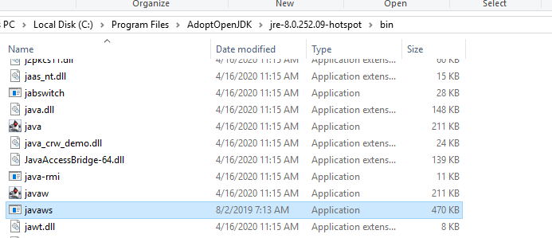

# AdoptOpenJDK Java Installation

APIS Process Explorer shows graphical trends from the APIS Historian database. Java must be installed on computer to open application.

To download and install AdoptOpenJDK the following steps can be followed.

1. Go to the download page: [Adopt open JDK](https://adoptopenjdk.net/releases.html)

2. Choose version 8 and Hotspot.

3. 64 bit JRE:

    * Choose Operating system: Windows and Architecture: x64.

    * Choose number 3 in the list over downloads, JRE (msi).

4. When installing AdoptOpenJDK 64 bit, make sure to add all features as shown below:

5. Install.

6. PE requires Java Web Start (JWS) to be installed on the computer. The 64-bit AdoptOpenJDK JRE setup kit includes JWS. All computers running PE must have the 64-bit AdoptOpenJDK JRE installed.

The current version of the AdoptOpenJDK install kit does not set the Content Type for jnlp files in the Registry. For PE to open correctly, the Registry must be updated with the following registry key:

 

This can be done manually or by importing a reg-file.

The next version of the AdoptOpenJDK setup kit will set up this key correctly.

Workaround: Browse to PE in a browser and download the file. (this file is missing the .jnlp extension).

Move the file from Downloads to the Desktop. Rename the file to include the .jnlp extension, i.e. PE.jnlp.

You should now be able to start PE any time by double-clicking the file.

7. To open jnlp files from e.g. process explorer, open the files with javaws in the bin folder.

