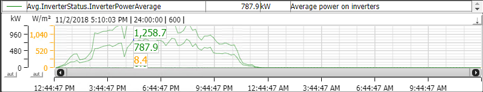

# Trend Curves

Trend curves shown in the screens display real time trend information for a set of data tags. The curves are filled with historical data at load time, and then updated with real time data as long as the screen is displayed.

In top of the graph, tag information is shown. This can be different information from each graph, but in general tag name/description, value and unit is shown. Color is same as the curve color. If not all tags are shown, you can scroll to the left of the list. You can also show more tags, by expanding the list in the bottom. Hold the mouse over the wide line, will open the double arrow and make it possible to expand the list.

Pressing the  button in top right corner hides the tag list. Pressing the  again, shows the list.

Values in list shows default last value. By clicking in the chart, a ruler appears and values and time for the time stamp is shown in the list. Double clicking in the chart, also shows the values on the ruler as shown in example below.

The y-axis shows the values and unit. The axis can be separate or merged for several curves. One can have manual and auto scaling, and also set several other options. Select one or more of the axis by clicking on them with left mouse (they turn grey) and then right click to get options.

The x-axis shows the time. The time span can be changed, right clicking the x-axis and selecting Timespan menu.

User can load more historical data by right clicking x-axis and press "Fetch More Data". Pressing the single arrows on x-axis, moving time span within the already loaded span and data. One can also move in time, dragging the scroll slider between the arrows.

 

Right click x-axis options:

Change the time label format
Fetch more data
Move the x-axis
Right clicking chart options:

Print chart
Sava data in chart to textfile
Change time span
Change grid presentation
Toggle ruler presentation
Change background color
Export data to textfile
View the data in APIS Process Explorer
 