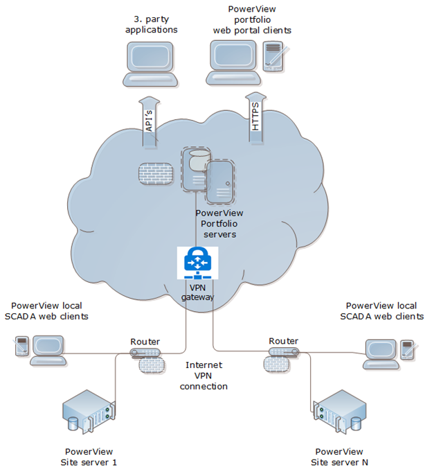
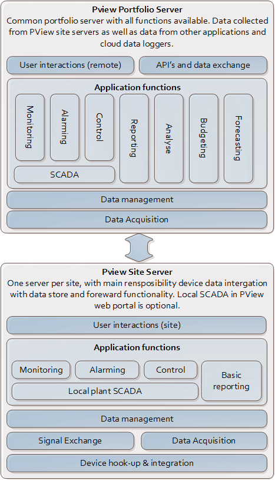

# Infrastructure Architecture

PowerView™ application software and application functions are typically installed and split on a PV plant/site infrastructure and a centralized/cloud infrastructure as shown in figures below. 

- PowerView™ Site Server: 
    - Server/PC installed on site and connected to plant network and internet
    - Main function is collecting real time data from site devices with store and forward functionality to portfolio system. Local SCADA can be added if needed.
- PowerView™ Portfolio Server: 
    - Centralized server installed in public or private (customer) cloud. (Can also be on customer on-premise server)
    - Contain data and functionality for all sites, with remote SCADA, reporting and analyses on site and portfolio level.

The functional blocks on each server can be added as needed.

If data is already collected and stored in centralized/cloud data store, and no real time data interaction with site is needed, the site infrastructure is not needed.

If only single site functionality with local SCADA is needed, no centralized/cloud server is needed.
