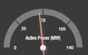
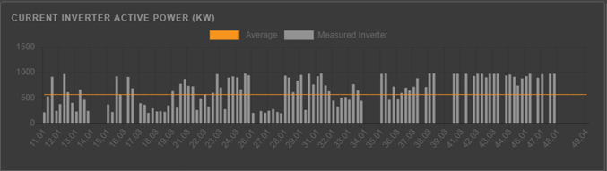

# Screen Visualizations

The monitoring screen contains dynamic and static presentation elements, showing real time data from the real time data hub and historical time series data from the APIS Honeystore time series database. 
The data can be raw data from the data source, or aggregated before presentation.

The screen contains links and navigation elements to navigate to other related pages. Buttons is used to refresh data and do other actions in the screens.

Following main data presentation elements are found in the screens:

- Dynamic numeric and text values
- Dynamic and static img
- Bar graphs
- [Alarm lists](../Alarm%20Lists/Alarm%20Lists.md)
- [Trend curves](../Trend%20Curves/Trend%20Curves.md)
- Historical charts with time input

Holding the mouse over a data element, will display a tooltip with the data tag description.

The top bar of the monitoring screens, shows last active alarm on the system. Clicking on the header, opens the alarm list in a pop-up window.

The pop-up window opens in new windows and must be closed pressing the upper right cross on the window.

## Gauges and dynamic bar charts
Gauges and dynamic bar charts are updated continously from real time measurements

Gauge example:

Bar chart example:

 
Click on chart legend on the bar chart to show/hide chart.

Hover bar/value to get value and description.

## Engineering Units
Most tags have an engineering unit, e.g. kW. the unit is registered on the real time and on the historical tags. 
Most tags have basic SI units like A, V and Wh as its basic unit. 
Another unit can be used for presentation though, using a conversion factor. E.g. energy is measured in Wh from the meters, but displayed as MWh.

It is also possible to switch from SI metric units to e.g. American units. 
If your operating system is configured with English US language in web browser, American units will be shown. 
See web browser setup for how to change the language settings.

## Status colors
Status img are shown with predefined colors as follows:

Inverter:
- Operating: green
- Stop or line restraint: grey
- Warning: yellow
- Error: red
- Communication failure: Grey with yellow border
- Grounded: blue

Tracker
- Operating: green
- Stop or line restraint: grey
- Warning: yellow
- Error: red
- Communication failure: Grey with yellow border

Switches and breakers:
- Normal state (e.g. closed for a MV breaker): green
- Not normal state: red
- Undefined position: yellow
