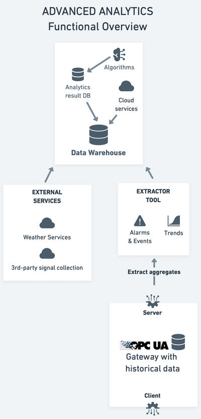

# Advanced analytics

When signal data is collected and combined with data from other external services and sources, it can be used to create advanced analytics. The purpose of the advanced analytics is to provide insights into the data, and to provide predictions about the future. This is done by using a number of different methods, such as machine learning, statistical analysis, and rule based analysis. The advanced analytics can then be made available through a number of different user interfaces, such as dashboards, reports, and notifications.

