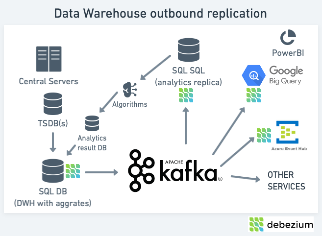

# Synchronizing with other systems

There are several scenarios where you might want to synchronize data between the original data warehouse and other systems. For example, you might want to synchronize data with a data lake, or with a data warehouse in another region. It can also be the basis for high availability and disaster recovery, or simply load balancing.

## Debezium

Using [Debezium](https://debezium.io) and its connectors, we can stream data from the data warehouse database to other systems. Debezium is an open-source distributed platform for change data capture. Start by reading the [Debezium tutorial](https://debezium.io/documentation/reference/tutorial.html) to get an overview of the platform. The features available in the product goes well beyond what is described in this context, allowing our clients to take advantage of the platform for other use cases.

### Debezium connectors

Designed to capture changes in the database, Debezium connectors can be used to stream data to other systems. While a number of connectors are available, we use the [SQL Server connector](https://debezium.io/documentation/reference/2.2/connectors/sqlserver.html) to catch any changes in the data warehouse and stream them through Kafka Connect to other systems.

If you want to balance the load between two or more clone SQL servers, you can use the same connector to populate the other servers. This is a simple way to achieve high availability and disaster recovery.

Using connectors for different cloud based systems such as Google BigQuery, Amazon Redshift, Snowflake, and Azure Synapse Analytics, you can stream data to these systems. This is a simple way to synchronize data between the data warehouse and a data lake.

## Data lake synchronization example

The following example shows how to synchronize data between the data warehouse and a data lake. The data lake is hosted in Google BigQuery, but the same approach can be used for other cloud based data lakes.

### Debizium infrastructure in the auxiliary environment

Using Strimzi to host Kafka in the auxiliary environment, we can use the [Debezium SQL Server connector](https://debezium.io/documentation/reference/2.2/connectors/sqlserver.html) to stream data from the data warehouse to the data lake. The following diagram shows an advanced setup with replication happening from the data warehouse to multiple sources, including BigQuery.

