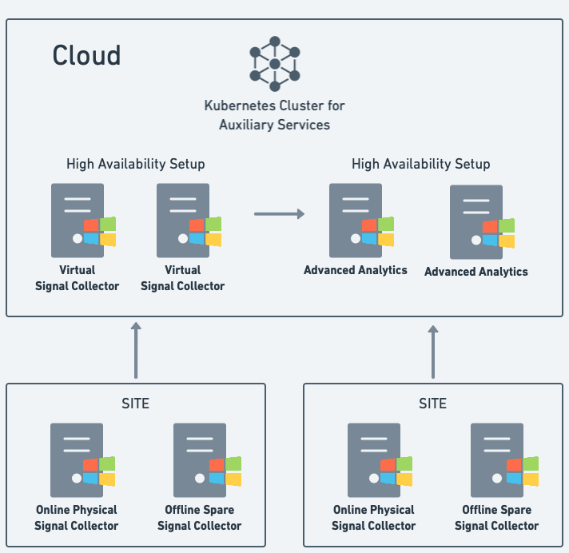

# Setting up an environment

The following sections will describe how to set up an environment for PowerView. The sections will describe the minimum requirements for the environment, and also how to set up a distributed environment.

Let's start with the minimum requirements for the environment.

## Minimum requirements

The following picture illustrates the minimum requirements for the environment:

