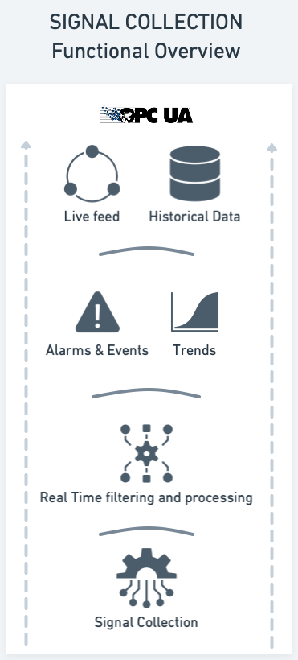

# Signal Collection

Signal Collection happens when equipment reports state to the system. The state can be a measurement, a status, or an event. The state is reported to the system through a communication channel, which can be a direct connection to the equipment, or it can be a connection to a gateway. The communication channel can be wired or wireless, and it can be a standard protocol or a proprietary protocol. For some equipment, the collection is handled by the equipment manufacturer and presented as a cloud service.

For industrial sized installations, a mix of communication channels is common. For example, a site may have a mix of wired and wireless communication channels, and a mix of standard and proprietary protocols. The communication channels can also be a mix of direct connections to the equipment and connections to gateways. The gateways can be located close to the equipment, or they can be located in a central location. The gateways can also be located in a cloud environment, such as Azure, or in an on-premises environment. Our solution is designed to handle this mix of communication channels and then present the data in a uniform way through a standard protocol (OPC UA).

Data from the equipment is collected by the PowerView Signal Collector, which is a software component that is installed on a server with a Windows OS. Data from cloud based services are commonly ingested directly into our advanced analytics infrastructure. Your demands for availability and functionality dictates the choice of running environment for the Signal Collector. For scenarios where operations on site is mainly focused on doing signal collection, and any user interface etc. is made available through the cloud, the built-in HA functionality of our software is a good choice. For scenarios where the solution made available at the location consists of more than just signal collection, such as a user interface, then the virtualization platform is a good choice. This is described here: [Signal Collection - Running Environment](running_environment.md).

Migrating data vertically, and as such from locations to a central location, is a common scenario. This is described here: [Signal Collection - Vertical Migration](vertical_migration.md).

From signal collection to signal storage, the data is processed in a number of steps, as visualized in the diagram below and described in detail in the chapter on Data Collection.

