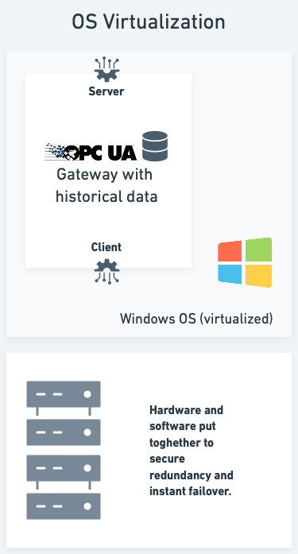

# Signal Collection - Running Environment

The PowerView Plant Connector is a software component that is installed on a server with a Windows OS. It utilities a number of different technologies and methods to make this collection and storage as robust and efficient as possible, many of them highly OS dependent. Running the Plant Connector on a virtualized environment does not present any challenges, which leaves two choices when it comes to High Availability (HA) and Disaster Recovery (DR):

1. Use the built-in HA functionality of our software
2. Use the HA functionality of the virtualization platform

## Built-in HA

For scenarios where operations on site is mainly focused on doing signal collection, and any user interface etc. is made available through the cloud, the built-in HA functionality of our software is a good choice. This is a simple and cost effective solution, and it is easy to set up and maintain. The solution is based on the following principles:

Please notice that some industrial protocols, such as OPC UA, have built-in HA functionality. This is not the case for all protocols, including Modbus, and it is not the case for all equipment. As a result, these protocols can sometimes allow only one subscriber to the data at a time. This is not a problem for the PowerView Plant Connector, as it can be configured to act as a proxy for the data, and then allow multiple subscribers to the data, but automatic failover is not possible in this scenario.

## Virtualization HA

There is practically limitless possibilites when it comes to HA and DR in a virtualized environment. The most common scenario for us is to use hypervisors to run one or more virtual OS's, automatically switching over if any issues should arise. and then use a load balancer to distribute the load between the two virtual machines. This is a good solution, but it is also a complex solution, and it requires a lot of resources. Supporting functionality such as shared storage and physical connections between the hardware can pull the solution in an even more extreme direction. 

If the solution made available at the location consists of more than just signal collection, such as a user interface, then the built-in HA functionality of our software is not sufficient. In this case, the virtualization platform is a good choice.

The solution is based on the following principles:

