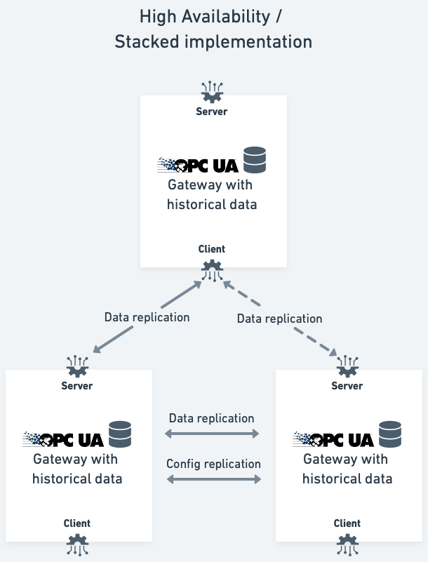

# Vertical migration of data

There are multiple situations where splitting the data collection into several smaller systems is beneficial. This can be due to the physical location of the equipment, the communication channels available, or the amount of data that needs to be collected. In these situations, the data is collected in one system, and then migrated vertically to a central location.

We always use our built-in functionality to migrate data vertically. This allows us to use the same functionality for both vertical and horizontal migration, and it allows us to use the same functionality for both migration and storage. Also, it is highly configurable, allowing e.g. different data resolution in the different systems.

This is visualized in the diagram below:

