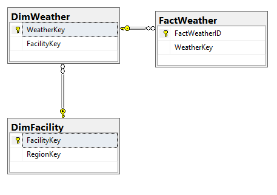

# Data Warehouse Schema

The data warehouse schema has the following main tables and schemas usable for external API access:
- [Dim tables](DimTables.md) storing plant setup parameters and other meta data 
- [Fact tables](FactTables.md) storing actual data uploaded and augmented from the varoius data sources
- [KPI tables](KPITables.md) storing aggregated data in different dimensions, including time dimension
- Other supporting tables

Below, data base diagrams shows some of the main structures with relation.

## KPI Aggregated Data
Aggregated KPI data related to plant.
Use these tables to get e.g. daily KPI data in your BI tool.
KPI_Plant has the plant dimension, KPI_PeriodType the time dimension and KPI_Definition the kpi type dimension.
KPI_Value contains the KPI values.

## Facility Data
These tables contains facility data on 10 minute, daily and event/state level.

## Sub Facility Data
These tables contains sub facility data on 10 minute and event/state level.

## Inverter Data
These tables contains inverter data on 10 minute, daily and event/state level.

## String Data
These tables contains string data on daily level.

## Weather Data
These tables contains weather data on 10 minute level.

## PPC and Metering Data
These tables contains PPC and meter data on 10 minute level.

## Tracker Data
These tables contains tracker data on 10 minute, daily and event/state level.

## Budget and Forecast Data
These tables contains budget and forecast data on hourly/daily level.
Typically data loaded from Excel import and/or through web interface.

## External Weather and Forecast Data
These tables contains external weather and forecast data loaded from external data providers.

