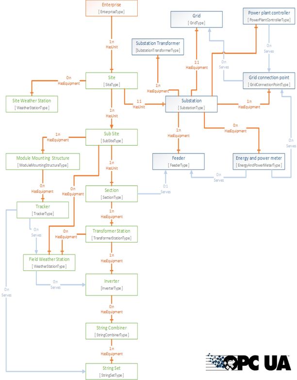

# Data management

Data management is data filtering, processing and logging the collected data.
Raw data is logged in databases for time series (historian) and alarms&events. 

Data is logged with data quality, filtering out bad signals before used in further processing and data analyses

The data is then structured using an information model implemented using the OPC UA information standard as shown in image below:
- Standard PV information model that puts operational data in context
- Data, parameters and structure for all plants in same semantics context
- Implemented with OPC UA for standard an open access from client tools
- Parameters in model describes plants and equipment, like location, nominal values etc. 
- Variabels is raw signals and [processed signals](processing.md)
- Data from information model can be accessed as real time data or historical data in PowerView [user screens](../../user_interfaces/) or through [standard API's](../../data_access/)

