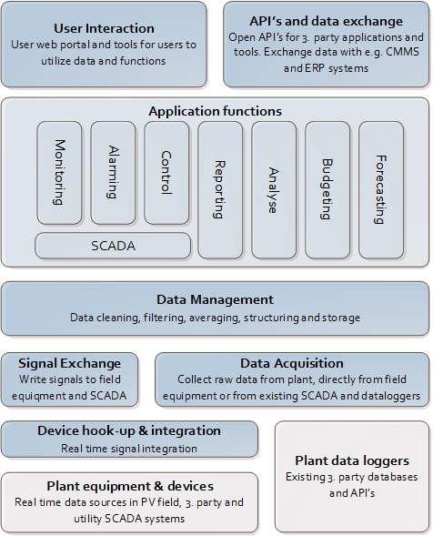

# Functional Architecture

A high-level functional architecture of PowerView™ is shown in figure below. Typical functions are split between software executed on a local site server/PC and a centralized portfolio cloud server. More detailed on functions are explained below figure. 

## Plant equipment & devices
Plant equipment & devices are all devices on solar plant as well as devices on utility substation and control centre. These devices need to be connected to a local network in order to extract data from them in real time. They also need to provide a standard communication protocol for data exchange, e.g. Modbus TCP or OPC UA.

## Plant data loggers
Plant data loggers are 3. party system with historical data logging capabilities and/or APIs for real time and historical data access. One example can be a local inverter data logger with capabilities of generating files and transfer with FTP to PowerView™. Another example is a cloud database with an API to extract real time as well as historical data from devices on site.

## Data hook-up and integration 
This is the real-time data integration of signals providers in the PV field and substation, like inverters, trackers, weather stations, PPC’s, meters, etc. PowerView™ have library of many known equipment suppliers and models, and new ones are added continuously. Standard data protocols are used over plant network to acquire data, like Modbus TCP and OPC UA.

## Data acquisition 
This is the basic function for most of the PowerView™ applications. Raw data is collected from available devices and loggers either real time and/or historical. Data is sent to next level for pre-processing before used in application functions.

## Signal exchange
This function block includes writing control signals to devices and equipment in the PV field or sending status information to other clients like the grid utility. Examples of control functions are PPC setpoint and mode control, inverter status and mode control and tracker manual positioning. Example of status signal exchange, is sending weather data and inverter status information to utility SCADA solution trough plant PLC.

## Data management 
This layer pre-process and filters the data in order to be able to use the data for reporting and analysis. Bad signals and outliers are filtered out and removed from the final data set. Data is averaged into lower sampling rates in order to use for long time storage, and data is structured into a standard information model in order to apply standard functions for monitoring, analyses and reporting. 
 
## Application functions 
This is all functions available to user transforming data into information, knowledge and actions. 
The functions are described in more details below and will vary between each setup based on data and systems available and customer requirements. 

## User interaction
User interaction is providing the PowerView™ application functions to the users in a secure and effective manner. 
Main access is the PowerView™ web portal. Users are authenticated in web portal and given access to applications functions based on a role-based security and access control system.  
Other way of providing data to users are through automatic submission of emails with reports and alarms. 

## APIs and data exchange
Data in PowerView™ can be accessed from third party application through standard APIs. This includes analytical applications, reporting tools, monitoring tools and CMMS applications. PowerView™ is based on open and standard technologies, making it easy to integrate with 3. party applications if needed. If custom access is needed, this can be added using wizards and templates. 

