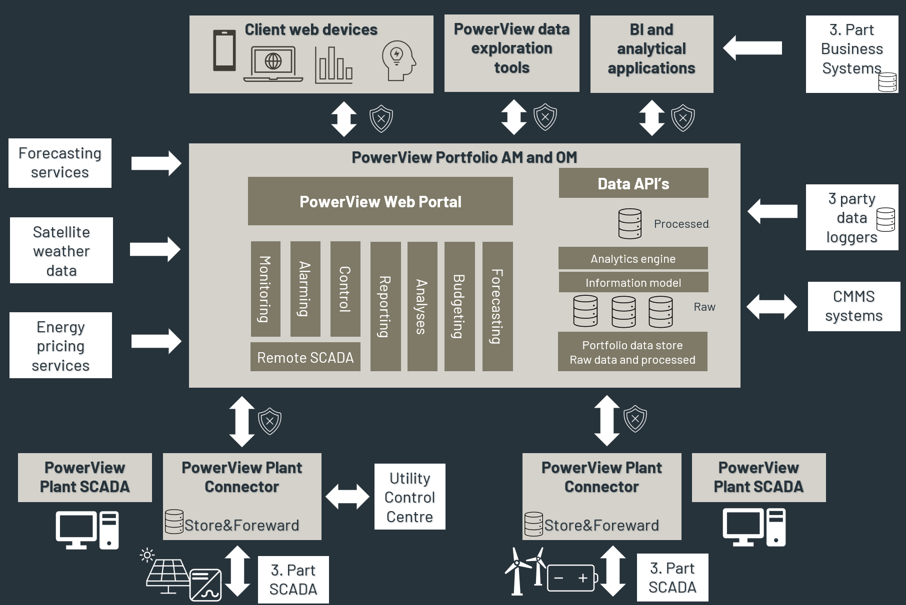

# Software Architecture
The diagram below shows the overall architecture of PowerView with the following main blocks:
- PowerView Plant Connector
- PowerView Plant SCADA
- PowerView Portfolio
 
All PowerView solutions utilize and is built upon Prediktor’s APIS platform to connect, collect, store and contextualise data. 
Below APIS products are named and links to general APIS user guides. 

## PowerView Plant Connector
- Software is installed on the site server with Windows OS to collect, process and store real time data from plant devices and local 3rd party control systems.
- <a href="https://docs.prediktor.com/docs/foundation9/APIS_Hive/APIS_Hive.html" target="_blank">APIS Hive</a> is used as real-time integration platform for Connect, Process, Map and logging functionality.
- Modules for inbound data interfaces from plant data sources (Modbus TCP, OPC UA, etc.) from data sources on production network (e.g. Inverters, wind turbines). 
- <a href="https://docs.prediktor.com/docs/foundation9/APIS_HoneyStore/APIS_HoneyStore.html" target="_blank">APIS Honeystore</a> time series database for logging/storing of time series data.
- Data server for outbound data (OPC UA/DA/HDA) with mechanisms for catch up (to PowerView Portfolio solution).
- Real-time data processing using function items for calculations.
- <a href="https://docs.prediktor.com/docs/foundation9/APIS_Chronical/APIS_Chronical.html" target="_blank">APIS Chronical</a> alarm&event server for real time alarm processing and logging. Implementing OPC UA AC and OPC AE outbound interface.
- OPC UA information model for data structure and mapping.

## PowerView Plant SCADA
- Software for monitoring and control locally on the plant
- Software installed on local plant server
- PowerView web portal with monitoring and control functions
- Manual data correction functions
- Basic reporting

## PowerView Portfolio
- Software installed on portfolio servers and interface with data sources on site and implement application functionality for monitoring, reporting,analysis and etc..
- Windows OS and Docker containers.
- <a href="https://docs.prediktor.com/docs/foundation9/APIS_Hive/APIS_Hive.html" target="_blank">APIS Hive</a> real-time integration platform for Connect, Process, Map and Store functionality.
- OPC UA technology for real-time and historical replication of data from PowerView Plant Connector (measurements and Alarms&Events).
- <a href="https://docs.prediktor.com/docs/foundation9/APIS_HoneyStore/APIS_HoneyStore.html" target="_blank">APIS Honeystore</a> for replicated historian data.
- OPC UA information model for data structure and mapping.
- MS SQL Server data warehouse for processed data (KPI’s, etc.) 
- Analytical engine in Python and SQL calculating and storing KPI’s and other augmented data.
- Interface to external services and application (Forecasting, CMMS, etc.) using Rest API’s.
- Data available to BI and 3rd party analysis applications (PowerBI, Grafana, etc.) through API’s or through direct SQL connection.
- Python library for accessing data in OPC UA information model (model index structure and real time/historical data).
- Web portal for user interaction with secure login and access control.
- Web based monitoring and control functions in PowerView Powerhub.
- Paginated reporting using Bold Reports and/or Reporting Services.
- Analysis dashboards using Bold BI and/or PowerBI.
- Interface to 3rd Party data loggers using Rest API integrations.

